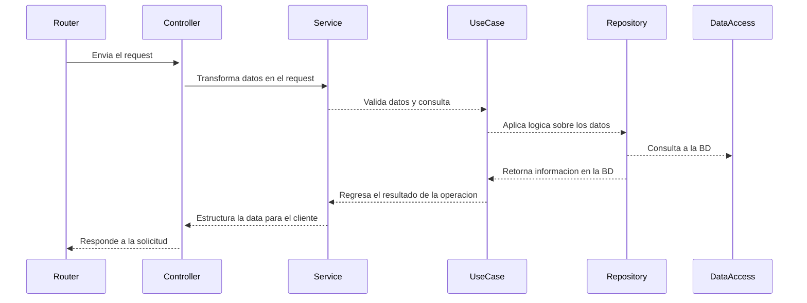

# Nectia - Gestión de Tareas y Usuarios

Esta API proporciona endpoints para la gestión de tareas (CRUD) y autenticación de usuarios, basada en JSON Web Tokens (JWT). La arquitectura utilizada es hexagonal, y ha sido desplegada en AWS Lambda, y documentada con OpenAPI [Documentación Swagger](https://docs.nectia.empiretive.com)

#### Nota - Puedes descargar el archivo doc.yml de la carpeta docs, o directamente en la documentación swagger, e importarlo en postman como una colección

## Tabla de Contenidos
- [Requisitos](#requisitos)
- [Instalación](#instalación)
- [Documentación](#documentación)
- [Estructura del Proyecto](#estructura-del-proyecto)
- [Arquitectura Hexagonal](#arquitectura-hexagonal)
    - [Flujo](#flujo)
    - [Dominio](#dominio)
    - [Acceso a Datos](#acceso-a-datos)
- [Solución del reto](#solución-del-reto)
- [Despliegue](#despliegue)
- [Tecnologías](#tecnologías)

## Requisitos

- Node.js >= v18
- MongoDB

## Instalación

1. Clona el repositorio:
    ```bash
    git clone https://github.com/Jesus3m/nectia-challenge.git
    ```
2. Instala las dependencias:
    ```bash
    npm install
    ```
3. Configura las variables de entorno:
    Crea un archivo `.env` en la raíz del proyecto con las siguientes variables:
    ```env
    PORT=3000
    JWT_SECRET=tu_secreto_jwt
    JWT_EXPIRES_IN=1d
    DATABASE_URL=mongodb://localhost:27017/tu_bd
    ```

4. Inicia la aplicación:
    - Desarrollo
    ```bash
    npm run dev
    ```
    - Producción
    ```bash
    npm run build
    ```
    ```bash
    npm run start
    ```

## Documentación

El proyecto ha sido desplegado en aws lambda y api gateway, puedes acceder a la API de desarrollo con el siguiente enlace: ``https://nectia.api.empiretive.com/v1`` y puedes ver la documentación en swagger y hacer peticiones en el siguiente enlace: [Documentación Swagger](https://docs.nectia.empiretive.com)

## Estructura del Proyecto

```plaintext
src/
│
├── common/           # Lógica común de la aplicación y utilidades
├───── adapters/      # Adaptadores para la aplicación, Abstracciones para librerías y funcionalidades  (jwt, encrypt, trabajo con fechas, etc.)
├───── config/        # Configuración y variables de entorno
├──────── connections/ # Conexión a bases de datos
├──────── server/     # Creación de servidores (http, grcp, sockets)
├──────── index.ts    # Objeto de configuración y variables del sistema
├───── decorators/    # Decoradores Personalizados para la aplicación
├───── errors/        # Clases de errores personalizadas
├───── generics/      # Clases Genéricas para cada capa (repository, service, controller, etc.)
├───── interfaces/    # Interfaces (filtros, peticiones, respuestas, etc.)
├───── middlewares/   # Middlewares (autenticación, validación, etc.)
│
├── core/             # Dominio y base de la aplicación
├───── *module_name*/ # Capas del dominio- Cada entidad tiene su propia carpeta en donde gestiona la logica de su dominio
├── infra/            # Capa de infraestructura (Puertos y Adaptadores de acceso a datos)
├───── data_access/   # Capa de acceso a datos (MongoDB) - Aca se crean los modelos que se conectan y consultan a la base de datos
├───── ports/         # Capa de puertos - Aca se encuentras los puntos de entrada a la aplicacion, ya sea por API REST, o por manejadores de lambda
├──────── rest/       # Capa de rest (API REST)
├──────── handler/    # Manejadores AWS Lambda
└── index.ts          # Punto de entrada de la aplicación
```


## Arquitectura Hexagonal

### Flujo

Para el flujo de la aplicación se ha utilizado un diagrama mermaid para mostrar la arquitectura de la aplicación y la interacción entre sus distintas capas



### Puertos
Dentro del directorio ``infra`` se definen los puertos de la aplicación, estos no son mas que puntos de entrada a la lógica del dominio (``core``), en este caso unicamente se crearon puertos de rest api (``rest``) y un manejador principal de lambda (``handler``), pero esta capa puede extenderse y crear mas interfaces de conexión como webhooks, websockets, graphql, etc.

### Dominio

Dentro del directorio ```/core``` se gestiona el dominio de cada una de las entidades de la aplicación, este dominio a su vez se divide en varias capas que distinguen la responsabilidad y acciones de cada entidad, por ejemplo:

Si tenemos una entidad ```User``` en nuestro sistema, el dominio podría estar compuesto por:
- Repositorio: ```user.repository.ts``` Esta capa es una interface que abstrae y define los métodos necesario para acceder a los datos almacenados en BD
- Servicios: ```user.service.ts``` Maneja la logica del negocio asociada con el dominio, en este caso usuarios, es en esta capa donde agregamos validaciones, conversiones, y utilizamos los repositorios y adaptadores, para acceder a la información
    - Casos de Uso: ```register_user.usecase.ts``` El servicio puede ademas acceder a casos de uso, que son componentes mas específicos para resolver un problema puntual, estos sirven para agrupar lógica y procesos relacionados con un caso de uso especifico y de esta manera encapsular mejor la solución al problemas cuando esta es muy compleja
- Entidades: ```user.entity.ts``` La entidad es una interface que define el esquema de datos del dominio

### Acceso a Datos

La capa de acceso a datos ubicada en ```infra``` son clases que utilizan el cliente de la BD, y realizan consultas para leer o escribir dichos datos. Esta clase es dependiente del dominio tanto a nivel de esquema de datos (``entity``) como a nivel de implementación (``repository``)


## Solución del reto
## Autenticación

Los servicios estan protegidos por JSON Web Tokens (JWT) que contienen información de usuario, tiempo de expiración y otros datos. El uso de este token es de forma segura y confiable, ya que solo el servidor puede leerlo.

Para acceder a la informacion de usuarios o tareas, necesitas obtener un token, puedes hacerlo a traves del endpoint de ``/auth/login`` con tu usuario y contraseña, si no cuentas con uno, puedes registrar uno en el endpoint de ``/auth/register``. Luego puedes hacer peticiones a la API con el token agregándolo en cada petición en el encabezado ``Authorization: Bearer {token}``.

## CRUD de usuarios y tareas

a traves de la rutas ``/user`` y ``/task``, siguiendo el estándar REST para la relacion entre metodos y acciones puedes aplicar operaciones sobre los usuarios siempre y cuando estes autenticado con el jwt: ``GET`` para obtener, ``POST`` para crear, ``PUT`` para actualizar y ``DELETE`` para borrar.

vease la [Documentación Swagger](https://docs.nectia.empiretive.com) para mas detalles y hacer pruebas


# Despliegue

Para el despliegue de la API se creo una canalización de Codepipeline, para crear un flujo de CI/CD, con lo cual, cada nuevo merge a la rama principal de proyecto inicia un proceso de compilación sobre el código fuente que posteriormente es desplegado en aws Lambda y API Gateway a traves de Cloudformation

# Tecnologías

- Node.js >= v18
- MongoDB
- OpenAPI
- Swagger
- Typescript
- Express
- JsonWebToken
- Bcrypt
- AWS Lambda
- AWS API Gateway
- AWS Codepipeline
- AWS Cloudformation