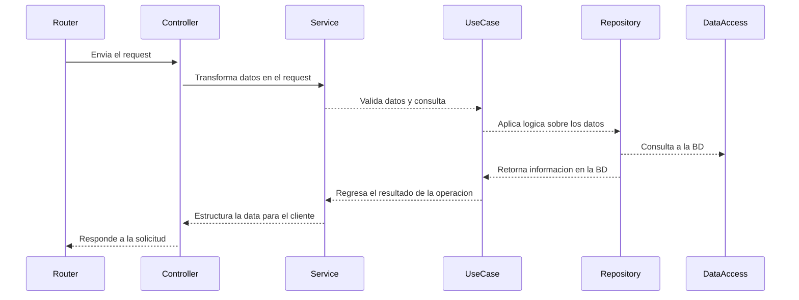

# Nectia - Gestión de Tareas y Usuarios

Esta API proporciona endpoints para la gestión de tareas (CRUD) y autenticación de usuarios, basada en JSON Web Tokens (JWT). La arquitectura utilizada es hexagonal, y ha sido desplegada en AWS Lambda, y documentada con OpenAPI.

## Tabla de Contenidos
- [Requisitos](#requisitos)
- [Instalación](#instalación)
- [Documentación](#documentación)
- [Estructura del Proyecto](#estructura-del-proyecto)
- [Arquitectura Hexagonal](#arquitectura-hexagonal)
    - [Flujo](#flujo)
    - [Dominio](#dominio)
    - [Acceso a Datos](#acceso-a-datos)
- [Dominio](#dominio)
- [Documentación](#documentación)
- [Autenticación](#autenticación)
- [Tecnologías](#tecnologías)

## Requisitos

- Node.js >= v18
- MongoDB

## Instalación

1. Clona el repositorio:
    ```bash
    git clone https://github.com/tu-repo/api-crud-tasks.git
    ```
2. Instala las dependencias:
    ```bash
    npm install
    ```
3. Configura las variables de entorno:
    Crea un archivo `.env` en la raíz del proyecto con las siguientes variables:
    ```env
    PORT=3000
    JWT_SECRET=tu_secreto_jwt
    JWT_EXPIRES_IN=1d
    DATABASE_URL=mongodb://localhost:27017/tu_bd
    ```

4. Inicia la aplicación:
    - Desarrollo
    ```bash
    npm run dev
    ```
    - Producción
    ```bash
    npm run build
    ```
    ```bash
    npm run start
    ```

## Documentación

El proyecto ha sido desplegado en aws lambda y api gateway, puedes acceder a la API de desarrollo con el siguiente enlace: ``https://nectia.api.empiretive.com/v1`` y puedes ver la documentación en swagger y hacer peticiones en el siguiente enlace: ``https://nectia.api.empiretive.com/v1/docs``

## Estructura del Proyecto

```plaintext
src/
│
├── common/           # Lógica común de la aplicación y utilidades
├───── adapters/      # Adaptadores para la aplicación, Abstracciones para librerías y funcionalidades  (jwt, encrypt, trabajo con fechas, etc.)
├───── config/        # Configuración y variables de entorno
├──────── connections/ # Conexión a bases de datos
├──────── server/     # Creación de servidores (http, grcp, sockets)
├──────── index.ts    # Objeto de configuración y variables del sistema
├───── decorators/    # Decoradores Personalizados para la aplicación
├───── errors/        # Clases de errores personalizadas
├───── generics/      # Clases Genéricas para cada capa (repository, service, controller, etc.)
├───── interfaces/    # Interfaces (filtros, peticiones, respuestas, etc.)
├───── middlewares/   # Middlewares (autenticación, validación, etc.)
│
├── core/             # Dominio y base de la aplicación
├───── *module_name*/ # Capas del dominio- Cada entidad tiene su propia carpeta en donde gestiona la logica de su dominio
├── infra/            # Capa de infraestructura (Puertos y Adaptadores de acceso a datos)
├───── data_access/   # Capa de acceso a datos (MongoDB) - Aca se crean los modelos que se conectan y consultan a la base de datos
├───── ports/         # Capa de puertos - Aca se encuentras los puntos de entrada a la aplicacion, ya sea por API REST, o por manejadores de lambda
├──────── rest/       # Capa de rest (API REST)
├──────── handler/    # Manejadores AWS Lambda
└── index.ts          # Punto de entrada de la aplicación
```


## Arquitectura Hexagonal

### Flujo



### Dominio

Dentro del directorio ```/core``` se gestiona el dominio de cada una de las entidades de la aplicación, este dominio a su vez se divide en varias capas que distinguen la responsabilidad y acciones de cada entidad, por ejemplo:

Si tenemos una entidad ```User``` en nuestro sistema, el dominio podría estar compuesto por:
- Repositorio: ```user.repository.ts``` Esta capa es una interface que define los métodos necesario para acceder a los datos almacenados en BD
- Servicios: ```user.service.ts``` Maneja la logica del negocio asociada con el dominio, en este caso usuarios, es en esta capa donde agregamos validaciones, conversiones, y utilizamos los repositorios y adaptadores, para acceder a la información
    - Casos de Uso: ```register_user.usecase.ts``` El servicio puede ademas acceder a casos de uso, que son componentes mas específicos para resolver un problema puntual, estos sirven para agrupar lógica y procesos relacionados con un caso de uso especifico y de esta manera encapsular mejor la solución al problemas cuando esta es muy compleja
- Entidades: ```user.entity.ts``` La entidad es una interface que define el esquema de datos del dominio

### Acceso a Datos

La capa de acceso a datos ubicada en ```infra``` son clases que utilizan el cliente de la BD, y realizan consultas para leer o escribir dichos datos. Esta clase es dependiente del dominio tanto a nivel de esquema de datos (``entity``) como a nivel de implementación (``repository``)

